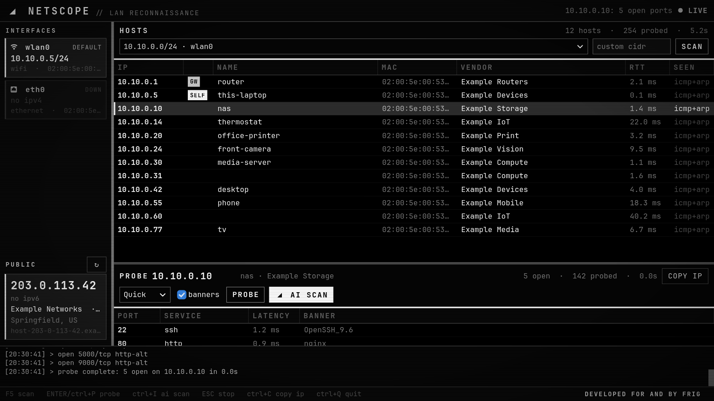

<div align="center">

# NetScope

**LAN reconnaissance, one click from your Omarchy bar.**

Local IP per interface, your public IP with ISP and location, every unit on the
network, a TCP port probe for any of them, and an AI investigation that names
the device and explains what each open port is for - in a window themed to
whatever Omarchy theme you are running.

<sub>Developed for and by frig.</sub>

</div>



---

## What it does

A bar widget with a glance popout, and a full window for the real work. The
popout is a thin face over the command line (`bin/netscope`); everything it
shows comes from `netscope --status --json`, so the bar and the app always
agree. Everything runs unprivileged - `ip`, `ping`, `avahi-resolve`, `curl`
and plain sockets. No root, no `nmap`.

- **Interfaces** - every network card with its IPv4/IPv6, MAC, state and
  gateway. Click an address to copy it.
- **Public** - your public IPv4/IPv6, ISP, ASN and rough location, cached ten
  minutes with a refresh on demand.
- **Hosts** - every unit on the chosen network. A ping sweep plus the ARP
  table, so devices that ignore ping still show up, with reverse-DNS, mDNS
  names and MAC-vendor lookup.
- **Probe** - pick a host and probe its TCP ports. Profiles: Quick (~150
  ports), Common (1-1024 plus well-known high ports), Full (all 65535) or a
  custom list like `22,80,8000-8100`. Grabs service banners where it can.
- **AI SCAN** - fingerprints the selected device (open ports, banners, mDNS
  services, HTTP titles, TTL) and streams an AI report that identifies the
  manufacturer and model, says what the device is, and explains what each open
  port is being used for. Pick the engine per investigation: a cloud CLI
  (`claude` or `codex`) or a **local Ollama** model, so a private
  investigation never leaves your machine.
- **Whole-network AI summary** - click the `⚠ N` badge by the HOSTS title (or
  `ctrl+shift+I`) for one report that inventories the LAN, ranks the risks, and
  gives concrete recommendations, built from the stored inventory and per-device
  findings.
- **Device identification** - active discovery (SSDP/UPnP, NetBIOS, and SNMP
  `sysDescr`, all unprivileged) pulls a device's friendly name, model, and type
  where it answers, and a heuristic combines that with vendor and open ports to
  guess a category (router, NAS, camera, printer, media, IoT, VM…). It feeds the
  AI investigation and is stored on the device.
- **Security posture** - after a probe, a rules engine grades the device's
  exposure: a `RISK N/100` badge with a level, and a findings popover that
  flags plaintext admin (Telnet, FTP), unauthenticated databases (Redis,
  MongoDB, Elasticsearch), risky management ports (Docker API, RDP, SMB), UPnP
  and a broad open-port surface. Awareness only - it describes exposure, never
  how to exploit it, and the findings are fed to the AI investigation too.
- **Wi-Fi context** - a WI-FI panel in the sidebar shows the current SSID,
  signal (percent and dBm), band and channel, link rate and security, from
  `nmcli` and `iw`.
- **IPv6** - sweeps also read the IPv6 neighbour table (pinging the all-nodes
  multicast group), attach global v6 addresses to hosts by MAC, and add any
  v6-only neighbours; hosts with IPv6 are tagged `+v6`.
- **Actions** - a `⋯` menu on the selected device: open its web UI (picks the
  right http/https port), SSH, send a Wake-on-LAN magic packet, ping in a
  terminal, or copy the IP.
- **Reports** - export the inventory as JSON, CSV, Markdown, or a self-contained
  HTML page (`ctrl+E` in the window, or `netscope --report`); `--sanitized`
  masks the public IP and location for sharing.
- **Terminal mode** - `netscope --tui`, a dependency-free curses UI with the
  same interfaces, Wi-Fi, public IP, live host list, sweep and probe.
- **Monitoring** - NetScope remembers every device by MAC in a persistent
  inventory. Name a device and mark it trusted from the probe row; untrusted
  present devices show an `UNKN` mark and a count badge (`⚠ N`) by the HOSTS
  title. Turn on **WATCH** (top bar) to keep sweeping, and get a desktop
  notification when an unknown device joins the network. A newly-seen device is
  tagged `NEW`. Watching sweeps for devices only; a new-open-port alert is
  raised when you probe a host again and find a port that was not there before.
  Devices with randomized/private MACs are not alerted on, because they rejoin
  under a new address each time (this also covers manually-set local MACs).

## Requirements

- `python3` 3.11 or newer, `python-gobject`, `gtk4` 4.12+, `libadwaita` 1
  (`omarchy pkg add python-gobject gtk4 libadwaita`)
- `iproute2`, `iputils` (ping), `curl` - present on stock Omarchy
- the command line, `netscope --tui` and the watcher need none of the GTK stack
- `avahi` for mDNS names (`avahi-resolve`, `avahi-browse`),
  `networkmanager`/`iw` for the Wi-Fi panel (optional)
- `wl-clipboard` to copy from the bar popout, `xdg-utils` to open a device's web
  UI and to find a terminal, `openssh` for the SSH action, `libnotify`
  (`notify-send`) as the fallback when `omarchy-notification-send` is absent -
  each only matters for the action that uses it (optional)
- for AI SCAN: a cloud AI CLI (`claude` or `codex`) **or** a local
  [Ollama](https://ollama.com) (`ollama serve` on `localhost:11434`) - optional
- `bubblewrap` (`bwrap`) if you use a cloud AI CLI: NetScope only ever runs one
  inside it, and without it the cloud engines are not offered. Ollama needs no
  sandbox - see [How a cloud engine is contained](#how-a-cloud-engine-is-contained)

## Install

```bash
omarchy plugin add https://github.com/frigstah/netscope.git --enable
~/.config/omarchy/plugins/io.github.frigstah.netscope/install.sh
```

`omarchy plugin add` clones the plugin and enables the bar widget; `install.sh`
links the `netscope` command into `~/.local/bin`, installs the desktop launcher
and icon, and checks dependencies. It writes nothing outside `~/.local` and
`~/.config`, and needs no root. `install.sh --enable` also places the bar
widget; `install.sh --watch` installs the background watcher described below.

## Bar widget

- **left** - popout (interfaces, public IP, last sweep)
- **right** - open the NetScope window
- **middle** - background LAN sweep
- popout keys - `o` open, `s` sweep, `r` refresh, `c` copy public IP, arrows + enter
- the bar icon follows the theme; enable "Tint icon on unknown device" to make it
  turn urgent while an untrusted device is present. The popout shows the unknown count

Settings live under the `io.github.frigstah.netscope` entry in
`~/.config/omarchy/shell.json`:

| key | type | default | what it does |
| --- | --- | --- | --- |
| `pollSeconds` | integer 5-600 | `30` | how often the open popout refreshes |
| `autoScanOnOpen` | boolean | `false` | sweep the LAN each time the popout opens |
| `barGlyph` | `access-point`, `radar`, `wifi`, `crosshairs`, `lan` | `access-point` | which glyph sits in the bar |
| `alertOnUnknown` | boolean | `false` | tint the icon while an untrusted device is present |

With the popout closed the widget does nothing at all unless `alertOnUnknown` is
on, and that poll runs `--no-public`, so an idle bar never contacts a third
party. Opening the popout is what refreshes the public address.

## Window

- `F5` sweep · `Enter` or `ctrl+P` probe the selected host · `ctrl+I` AI scan
- `Esc` stop · `ctrl+C` copy target IP · `ctrl+R` refresh · `ctrl+Q` quit
- double-click a host to probe it
- name a device and toggle **TRUST** in the probe row; **WATCH** monitors continuously
- two draggable dividers set the proportions: interfaces vs hosts, and hosts vs probe

## Command line

```
netscope                    open the window
netscope --status [--json]  interfaces, public IP, last sweep, inventory summary
              --no-public   skip the third-party public-ip lookup
netscope --scan [CIDR]      sweep (records changes, notifies on new devices)
netscope --probe IP --ports quick|common|full|22,80,8000-8100
netscope --assess IP        probe, then grade the security posture
netscope --identify IP      active discovery (UPnP/NetBIOS/SNMP) + device-type guess
netscope --wifi             current Wi-Fi link (SSID, signal, band, rate)
netscope --report FMT       export json|csv|md|html  (--out FILE, --sanitized)
netscope --wake MAC         send a Wake-on-LAN magic packet
netscope --tui              terminal UI
netscope --watch [--interval N]   sweep on a loop and notify on changes
netscope --inventory        list remembered devices (P present, T trusted, R randomized MAC)
netscope --events [--limit N]     recent change events
```

### Always-on monitoring

Run the watcher headless as a systemd --user service so alerts fire even when
the window is closed:

```bash
~/.config/omarchy/plugins/io.github.frigstah.netscope/install.sh --watch
```

It writes and enables `netscope-watch.service`. The inventory and event log
live in `~/.local/state/netscope/`. Stop it with
`systemctl --user disable --now netscope-watch.service`.

Set `NETSCOPE_NOTIFY=0` to mute desktop alerts for a run. Worth doing when you
script `--scan` in a loop or point NetScope at a fresh state directory, because
an empty inventory makes every device on the network look new at once.

`--json` on any of those gives machine-readable output.

## Privacy

The LAN sweep, port probe, device fingerprint and inventory all stay on your
machine. Two things do reach the internet:

- **Public IP lookup.** When you open the popout or the window (and on refresh)
  NetScope asks a third-party service for your public address and rough
  location: `api.ipify.org` (with `icanhazip.com` / `ifconfig.me` as fallbacks)
  and `ipinfo.io` for the ISP and city. Those services see your IP address by
  definition. The result is cached for ten minutes in `~/.cache/netscope`.
  `netscope --status --no-public` skips the lookup entirely, and the bar widget
  uses that whenever its popout is closed.
- **AI SCAN.** Sends the collected evidence about the selected device (or the
  inventory, for a whole-network summary) to whichever AI engine you pick.

The AI window never sends anything until an engine is chosen: with both a cloud
CLI and a local Ollama available it waits for you, and remembers the choice.
Pick **Ollama** to keep the investigation entirely on this machine, or skip
AI SCAN. Reports written with `--sanitized` mask the public address, Wi-Fi
identity, hostnames, MAC suffixes and any globally-routable device address;
private LAN addresses are kept.

### How a cloud engine is contained

The prompt an engine reads quotes text that devices on your LAN chose to send -
a hostname, an HTTP title, a service banner. Treat that as hostile input: it is
the one place an attacker gets to write into the prompt. Evidence is delimited
and marked untrusted, but the containment does not rely on the model ignoring
it. A cloud CLI is an agent runner, not a text API, so two things are done to it.

**Its tools are switched off.** `claude` runs with `--tools ""` (no built-in
tools at all), plus `--restricted` and `--strict-mcp-config` so it also ignores
your settings files and any configured MCP server. `codex` runs with
`--ignore-user-config`, web search off, and every tool-granting feature
disabled - `shell_tool`, `unified_exec`, `code_mode_host`, `apps`, `plugins`,
`browser_use`, `computer_use`, `view_image` and the rest - because a
read-only sandbox alone leaves its shell tool able to read files and reach the
network. Asked to read a file or print a credential, both engines answer that
they have no tools to do it.

`gemini` is not offered. It has no way to disable its tools from the command
line, and a settings file that claims to could not be verified here, so it is
left out rather than shipped unproven.

**It is run inside a bubblewrap sandbox.** Empty throwaway HOME, wiped
environment, read-only view of `/usr` and a handful of `/etc` files, and no
sight of your home directory: not `~/.ssh`, not `~/.config`, not this plugin.
The only secret inside is the credential for the very service being called,
bound read-only as a single file, because without it the CLI cannot log in.
The working directory is the same throwaway directory and is deleted after the
run. **Without `bubblewrap` installed, cloud engines are not offered at all** -
a local Ollama model still works, since it is an HTTP request with no tool loop
and no subprocess.

Network access stays open inside the sandbox, because reaching the model is the
point of the call; every tool that could fetch or search on its own is off.

SNMP queries use the read-only `public` community and never write.

Override the local endpoint/model with `NETSCOPE_OLLAMA_HOST` and
`NETSCOPE_OLLAMA_MODEL`. Set `NETSCOPE_NOTIFY=0` to mute desktop alerts.

## Layout

```
io.github.frigstah.netscope/
├── manifest.json      plugin manifest (bar-widget)
├── Panel.qml          bar icon + popout
├── install.sh         links the CLI, installs the launcher, checks deps
├── icon.png · preview.png
├── netscope.desktop   desktop launcher
├── CHANGELOG.md
├── bin/netscope       launcher (symlinked to ~/.local/bin/netscope)
├── app/netscope.py    entry point the launcher runs
└── app/netscope/      python package
    ├── core.py        interfaces, public IP, sweep, probe
    ├── store.py       persistent device inventory + event log
    ├── notify.py      desktop notifications
    ├── assess.py      security-posture rules + risk score
    ├── discover.py    active discovery (SSDP/UPnP, NetBIOS, SNMP)
    ├── recon.py       device fingerprint
    ├── ai.py          AI investigation (claude / codex / ollama)
    ├── actions.py     per-device actions (web/ssh/wol/ping)
    ├── report.py      json/csv/markdown/html reports
    ├── tui.py         curses terminal UI
    ├── theme.py       Omarchy colours + font -> GTK CSS
    ├── gui.py         GTK4 window
    └── cli.py         command line, headless watcher
systemd/netscope-watch.service   optional background watcher unit
```

## Uninstall

```bash
systemctl --user disable --now netscope-watch.service 2>/dev/null || true
rm -f ~/.config/systemd/user/netscope-watch.service
systemctl --user daemon-reload 2>/dev/null || true
omarchy plugin remove io.github.frigstah.netscope --yes
rm -f ~/.local/bin/netscope ~/.local/share/applications/netscope.desktop
rm -f ~/.local/share/icons/hicolor/256x256/apps/netscope.png
rm -rf ~/.local/state/netscope   # inventory + event history
rm -rf ~/.cache/netscope         # cached public IP, location and last sweep
command -v update-desktop-database >/dev/null && update-desktop-database ~/.local/share/applications || true
command -v gtk-update-icon-cache >/dev/null && gtk-update-icon-cache -q ~/.local/share/icons/hicolor || true
```

---

<div align="center"><sub>Developed for and by frig.</sub></div>
